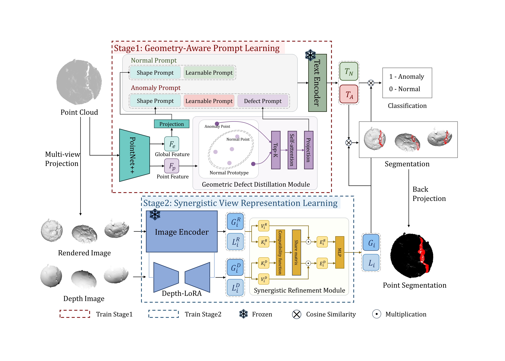

# GS-CLIP: Zero-shot 3D Anomaly Detection by Geometry-Aware Prompt and Synergistic View Representation Learning

## Introduction
Zero-shot 3D Anomaly Detection (ZS3DAD) is an emerging task that aims to detect anomalies in a target dataset without any target training data, which is particularly important in scenarios constrained by sample scarcity and data privacy concerns. While current methods leverage CLIP by projecting 3D point clouds into 2D images, they suffer from lost geometric details during projection and incomplete visual understanding due to their reliance on a single 2D representation. To address these limitations, we propose the Geometry-Aware Prompt and Synergistic View Representation Learning (GS-CLIP) framework, which enables the model to identify geometric anomalies through a two-stage learning process.In the first stage, we dynamically generate text prompts embedded with 3D geometric priors. These prompts contain global shape context and local defect information identified by our Geometric Defect Distillation Module (GDDM). In the second stage, we introduce a Synergistic View Representation Learning architecture that processes rendered and depth images in parallel. A Synergistic Refinement Module (SRM) subsequently fuses the features of both streams, capitalizing on their complementary strengths. Comprehensive experimental results on four large-scale public datasets show that GS-CLIP achieves state-of-the-art performance in both object-level and point-level metrics, validating the effectiveness of our proposed method.

## Overview


### Prepare Dataset
Download the original dataset at 
[Mvtec3D-AD](https://www.mvtec.com/company/research/datasets/mvtec-3d-ad), [Eyecandies](https://eyecan-ai.github.io/eyecandies/), 
[Real3D-AD](https://github.com/M-3LAB/Real3D-AD), [Anomaly-ShapeNet](https://github.com/Chopper-233/Anomaly-ShapeNet)

The rendering and depth images of Anomaly-ShapeNet are avalible at [here](https://pan.quark.cn/s/e227991e40b9).

The rendering images of MVTecAD-3D, Eyecandies, and Real3D-AD are avalible at [this](https://github.com/zqhang/PointAD), 

You can also genarate rendering and depth images through ./data_preprocess and [this](https://github.com/zqhang/PointAD/tree/master/multi_view).

### Generate the dataset JSON
Generate dataset json for training:

```bash
bash generate_dataset_json/generate_training_datasets_class_specific.sh
```

Generate dataset json for testing:

```bash
bash generate_dataset_json/generate_training_datasets_whole.sh
```

### Download Pretrained Weight
 Download the CLIP weights pretrained by OpenAI [[ViT-L-14-336.pt](https://openaipublic.azureedge.net/clip/models/3035c92b350959924f9f00213499208652fc7ea050643e8b385c2dac08641f02/ViT-L-14-336px.pt)].

 Download the PointNet++ initial weights at [here](https://github.com/yanx27/Pointnet_Pointnet2_pytorch/blob/master/log/sem_seg/pointnet2_sem_seg/checkpoints/best_model.pth) .
 
 Put them to ./pretrained_weights/


### Create Environments
```bash
conda create -n gsclip python=3.9
conda activate gsclip
pip install -r requirements.txt
```

### Train and Test
The two-stage training and test are included in train2.sh: 

Change the data path and run this script:
```bash
bash train2.sh
```

* We thank for the code repository: [PointAD](https://github.com/zqhang/PointAD), [AnomalyCLIP](https://github.com/zqhang/AnomalyCLIP)

## Citation
If you find our work useful, please cite us. Thank you.
```
@article{deng2026gs,
  title={GS-CLIP: Zero-shot 3D Anomaly Detection by Geometry-Aware Prompt and Synergistic View Representation Learning},
  author={Deng, Zehao and Liu, An and Wang, Yan},
  journal={arXiv preprint arXiv:2602.19206},
  year={2026}
}
```
